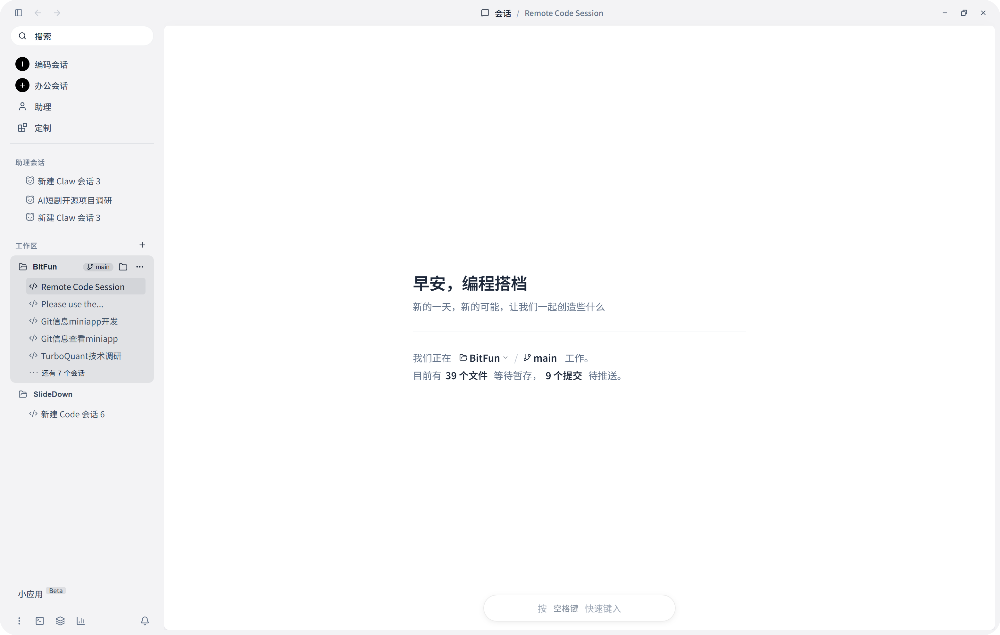

**中文**  [English](README.md)

<div align="center">


</div>
<div align="center">

[](https://github.com/GCWing/BitFun/releases)
[](https://openbitfun.com/)
[](https://github.com/GCWing/BitFun/blob/main/LICENSE)
[](https://github.com/GCWing/BitFun)

</div>

---

## 简介

BitFun 是一个Agentic OS，更是你亲密无间的伙伴。

它将能够通过手机、手表、桌面机器人等多样的方式进行交互，它在你的生活中无处不在，它会根据你来进行自我迭代。



---

## 远程遥控

扫码配对，手机即刻变成桌面 Agent 的远程指挥中心。一条消息，桌面上的 AI 立刻开始工作。

除手机浏览器扫码外，也支持接入 Telegram / 飞书 Bot / 微信 Bot 远程下达指令，并实时查看 Agent 的执行进度。

## 双模式协同

BitFun 提供两种模式，适配不同场景需求：

- **助理模式（Assistant Mode）**：有温度，记住偏好，具备长期记忆。适合持续协作类任务，如维护项目、延续你的审美与工作习惯。
- **专业模式（Professional Mode）**：省 token，直达执行，干净上下文。适合即时执行类任务，如修一个 bug、改一处样式。

---

## Agent 体系


| Agent            | 定位         | 核心能力                                                                    |
| ---------------- | ---------- | ----------------------------------------------------------------------- |
| **个人助理**         | 你专属的 AI 伙伴 | 长期记忆、个性设定；按需调度 Code / Cowork / 自定义 Agent，并可自我迭代成长                       |
| **Code Agent**   | 代码代理       | 四种模式：Agentic（自主读改跑验证）/ Plan（先规划后执行）/ Debug（插桩取证→根因定位）/ Review（基于仓库规范审查） |
| **Cowork Agent** | 知识工作代理     | 内置 PDF / DOCX / XLSX / PPTX 处理，可从 Skill 市场按需获取和扩展能力包                    |
| **自定义 Agent**    | 垂域专家       | 通过 Markdown 快速定义专属领域 Agent                                              |


## 生态扩展

> 它会自己成长。

支持 Skill、MCP（包含 MCP App）、自定义 Agent，此外还支持即用即生的 Mini App（从一句需求生成可运行界面，并可一键打包成桌面应用）。

---

## 平台支持

项目采用 Tauri，支持 Windows、macOS、Linux，同时支持通过手机浏览器、Telegram、飞书、微信等方式进行移动控制。

---

## 快速开始

### 直接下载使用

在 [Releases](https://github.com/GCWing/BitFun/releases) 页面下载最新桌面端安装包，安装后配置模型即可开始使用。

### 从源码构建

**前置依赖：**

- [Node.js](https://nodejs.org/)（推荐 LTS 版本）
- [pnpm](https://pnpm.io/)
- [Rust 工具链](https://rustup.rs/)
- [Tauri 前置依赖](https://v2.tauri.app/start/prerequisites/)（桌面端开发需要）

**运行指令：**

```bash
# 安装依赖
pnpm install

# 以开发模式运行桌面端
pnpm run desktop:dev

# 构建桌面端
pnpm run desktop:build
```

更多详情请参阅[贡献指南](./CONTRIBUTING_CN.md)。

---

## 贡献

欢迎大家贡献好的创意和代码，我们对 AI 生成代码抱有最大的接纳程度。请 PR 优先提交至 `dev` 分支，我们会定期审视后同步到主干。

**我们重点关注的贡献方向：**

1. 贡献好的想法 / 创意（功能、交互、视觉等），提交 Issue
2. 优化 Agent 系统和效果
3. 提升系统稳定性和完善基础能力
4. 扩展生态（Skill、MCP、LSP 插件，或对某些垂域开发场景的更好支持）

---

## 声明

1. 本项目为业余时间探索、研究构建下一代人机协同交互，非商用盈利项目。
2. 本项目 97%+ 由 Vibe Coding 完成，代码问题也欢迎指正，可通过 AI 进行重构优化。
3. 本项目依赖和参考了众多开源软件，感谢所有开源作者。**如侵犯您的相关权益请联系我们整改。**

---

